# APK Explorer & Editor - API & Integration Documentation

## Overview

This document outlines the internal APIs, integration patterns, and extensibility mechanisms within the APK Explorer & Editor application.

## Internal API Architecture

### Core API Interfaces

```mermaid
classDiagram
    interface APKProcessor {
        +boolean loadAPK(String path)
        +APKData getAPKInfo()
        +List~FileEntry~ getFileList()
        +InputStream extractFile(String path)
        +boolean validateAPK()
    }
    
    interface FileManager {
        +boolean createDirectory(String path)
        +boolean copyFile(String src, String dest)
        +boolean deleteFile(String path)
        +List~String~ listFiles(String directory)
        +long getFileSize(String path)
    }
    
    interface SignatureManager {
        +boolean signAPK(String apkPath, KeyStore keystore)
        +boolean verifySignature(String apkPath)
        +Certificate[] getCertificates(String apkPath)
        +boolean generateKeyStore(String keystorePath)
    }
    
    interface ProjectManager {
        +Project createProject(String name, String apkPath)
        +boolean saveProject(Project project)
        +Project loadProject(String projectPath)
        +List~Project~ getAllProjects()
        +boolean deleteProject(String projectId)
    }
    
    APKProcessor <|-- APKExplorer
    FileManager <|-- APKEditorUtils
    SignatureManager <|-- APKSigner
    ProjectManager <|-- Projects
```

### Data Access Layer APIs

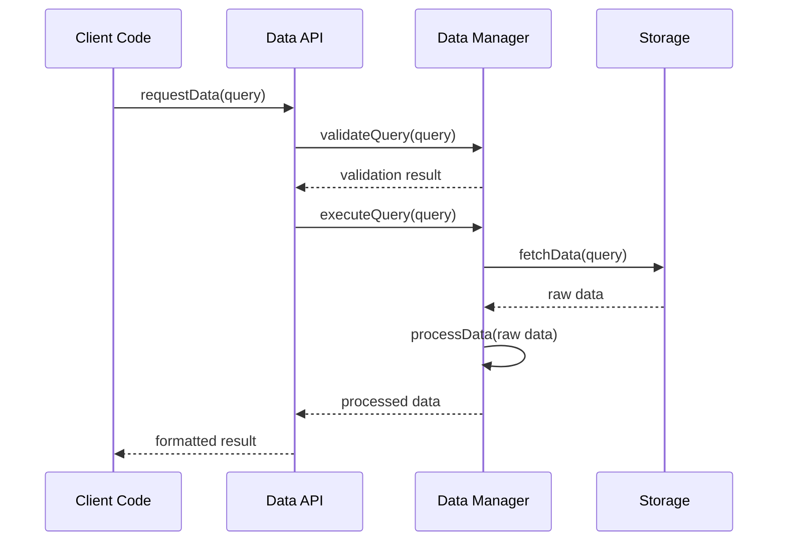

## Android System Integration

### Package Manager Integration

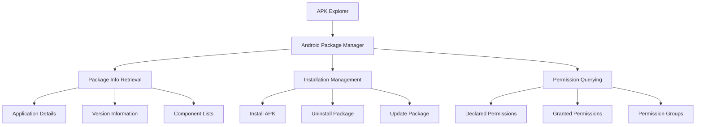

### File System Integration

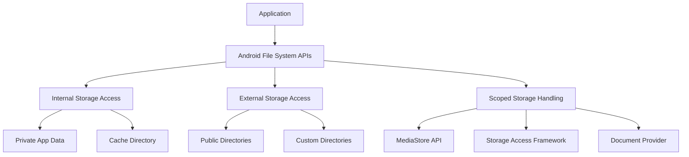

### Content Provider Integration

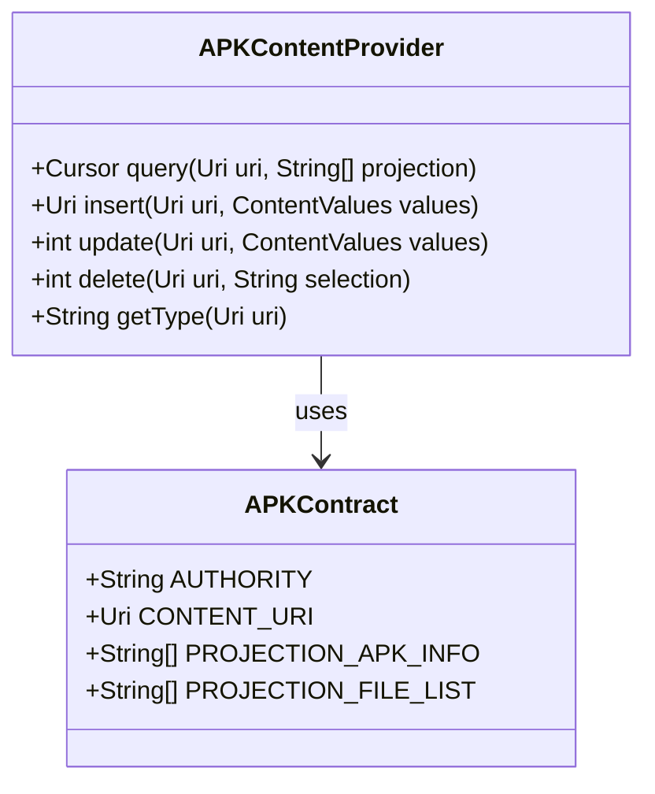

## Third-Party Library Integration

### External Dependencies Integration

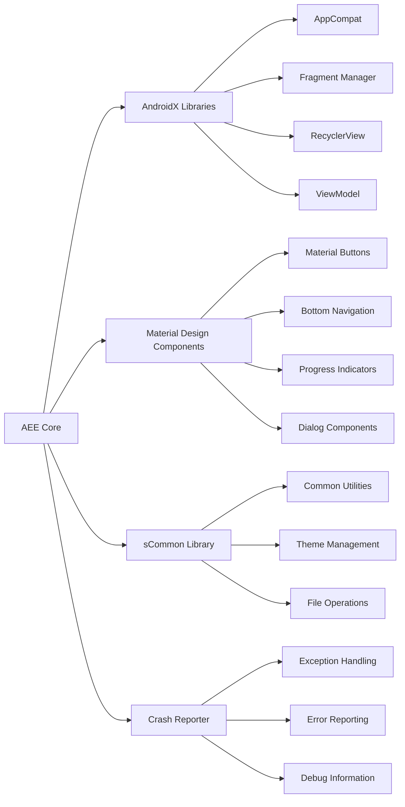

### Library Integration Patterns

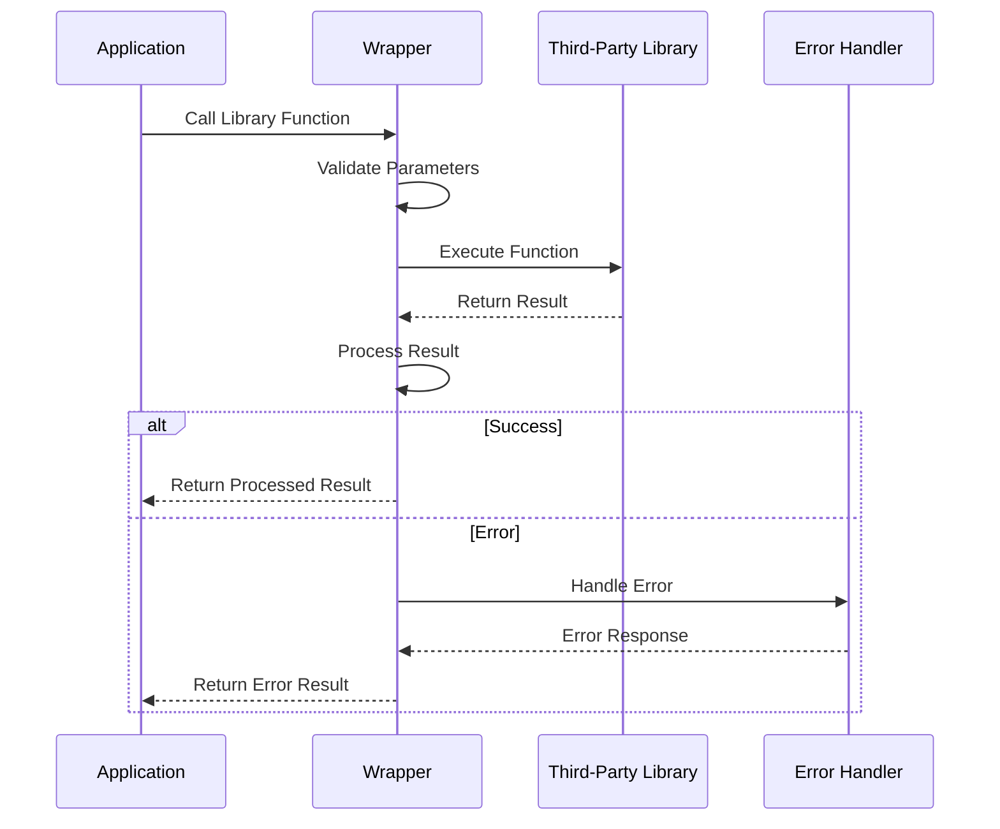

## Plugin Architecture

### Extensibility Framework

```mermaid
classDiagram
    interface Plugin {
        +String getName()
        +String getVersion()
        +boolean initialize(Context context)
        +void execute(PluginContext context)
        +void cleanup()
    }
    
    class PluginManager {
        +List~Plugin~ loadedPlugins
        +registerPlugin(Plugin plugin)
        +unregisterPlugin(String pluginName)
        +executePlugin(String pluginName, PluginContext context)
        +List~Plugin~ getAvailablePlugins()
    }
    
    class PluginContext {
        +APKData currentAPK
        +Project currentProject
        +FileManager fileManager
        +UICallback uiCallback
    }
    
    Plugin <|-- FileProcessorPlugin
    Plugin <|-- APKAnalyzerPlugin
    Plugin <|-- CustomSignerPlugin
    PluginManager --> Plugin : manages
    Plugin --> PluginContext : uses
```

### Plugin Lifecycle

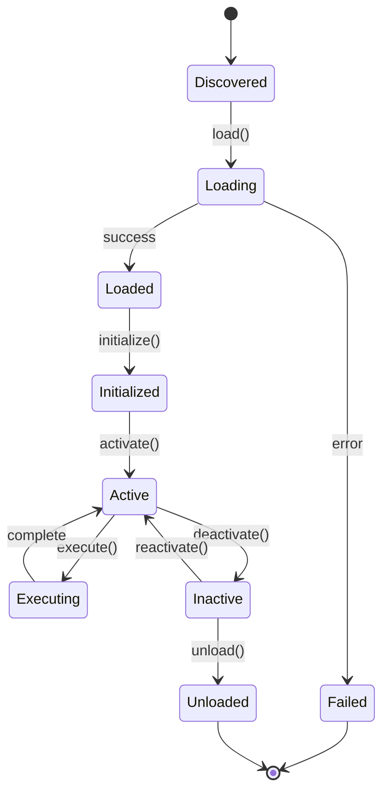

## Event System

### Application Event Bus

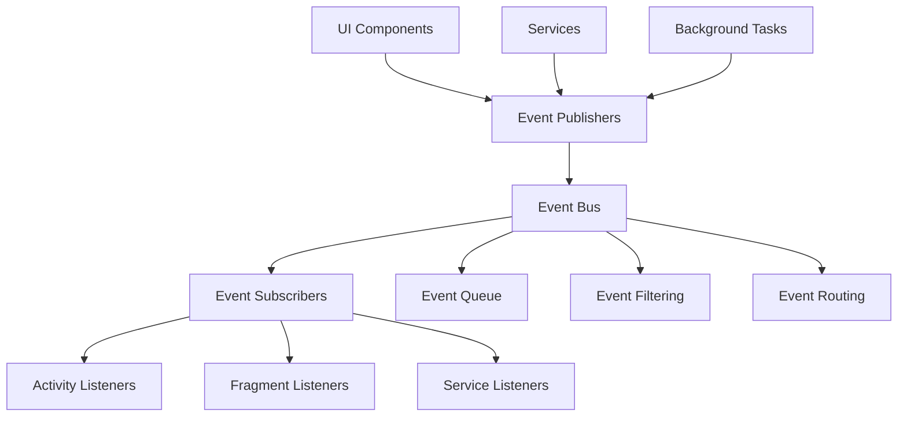

### Event Flow Patterns

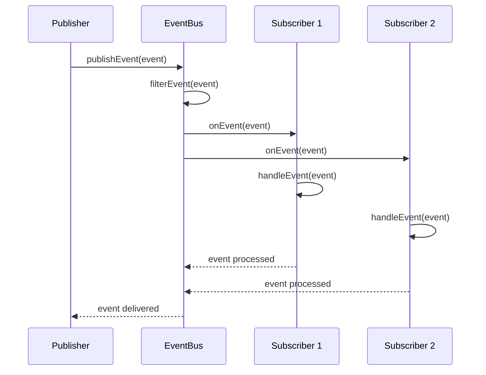

## Inter-Process Communication

### Service Communication Architecture

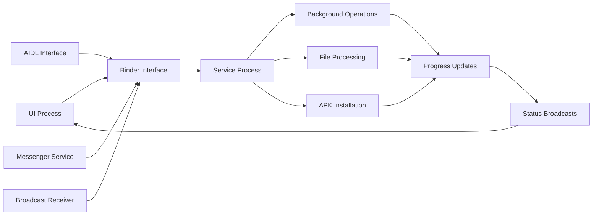

### Cross-Component Data Sharing

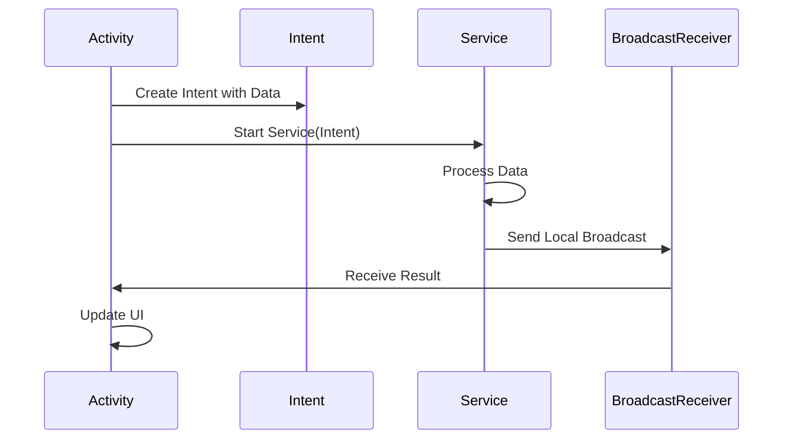

## External Integration Points

### File System Integration

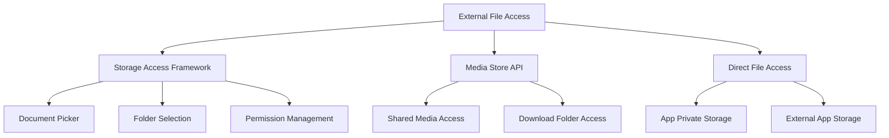

### System Service Integration

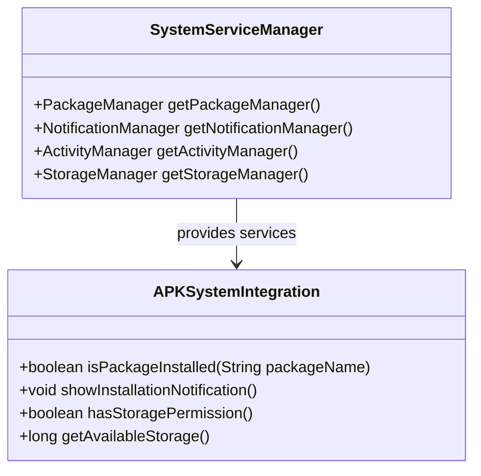

## Security and Permissions API

### Permission Management System

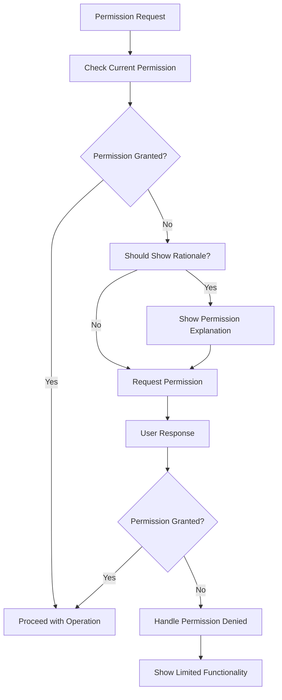

### Security Validation API

```mermaid
classDiagram
    interface SecurityValidator {
        +boolean validateAPKSignature(String apkPath)
        +boolean checkFileIntegrity(String filePath)
        +boolean isPackageTrusted(String packageName)
        +SecurityLevel getSecurityLevel(APKData apk)
    }
    
    class APKSecurityChecker {
        +CertificateChain getCertificateChain(String apkPath)
        +boolean verifySignatureMatch(String apk1, String apk2)
        +List~SecurityIssue~ scanForVulnerabilities(APKData apk)
    }
    
    SecurityValidator <|-- APKSecurityChecker
```

## Data Export/Import API

### Project Export System

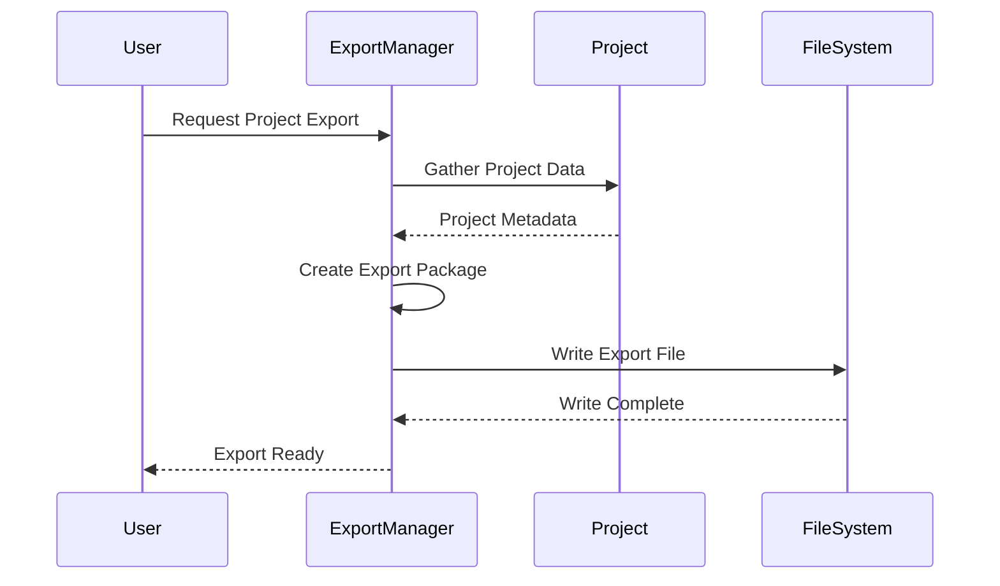

### Backup and Restore API

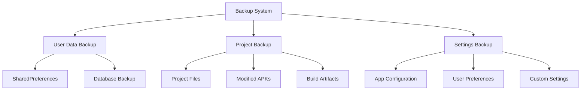

## Testing and Mock APIs

### Testing Framework Integration

```mermaid
classDiagram
    interface TestableComponent {
        +void setTestMode(boolean enabled)
        +TestData getTestData()
        +void injectTestDependency(TestDependency dep)
    }
    
    class MockAPKProcessor {
        +boolean loadAPK(String path)
        +APKData getMockAPKInfo()
        +List~FileEntry~ getMockFileList()
    }
    
    class TestDataProvider {
        +APKData createMockAPK()
        +Project createMockProject()
        +List~AppData~ createMockAppList()
    }
    
    TestableComponent <|-- MockAPKProcessor
    MockAPKProcessor --> TestDataProvider : uses
```

### API Mocking Patterns

```mermaid
sequenceDiagram
    participant T as Test
    participant M as Mock
    participant A as API
    participant R as Real Implementation
    
    T->>M: Setup Mock Behavior
    T->>A: Call API Method
    A->>M: Delegate to Mock
    M-->>A: Return Mock Data
    A-->>T: Return Result
    
    Note over M,R: In production, API delegates to Real Implementation
```

## Performance Monitoring API

### Metrics Collection System

```mermaid
graph TD
    A[Performance Monitoring] --> B[Execution Time Tracking]
    A --> C[Memory Usage Monitoring]
    A --> D[File Operation Metrics]
    
    B --> E[Method Profiling]
    B --> F[Operation Timing]
    
    C --> G[Heap Memory Tracking]
    C --> H[Native Memory Tracking]
    
    D --> I[Read/Write Performance]
    D --> J[File Size Analytics]
```

This API and integration documentation provides comprehensive coverage of how the APK Explorer & Editor integrates with Android systems, external libraries, and provides extensibility through well-defined interfaces.