# APK Explorer & Editor - Technical Architecture Documentation

## Overview

APK Explorer & Editor (AEE) is an Android application that provides comprehensive APK exploration, editing, and management capabilities. This document outlines the technical architecture, component relationships, and system design patterns used in the application.

## System Architecture

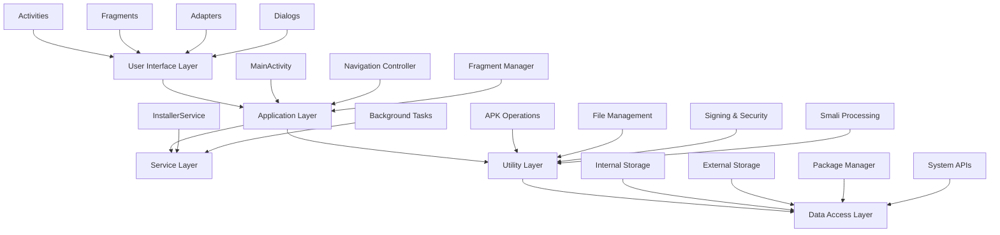

## Component Architecture

### Core Components Overview

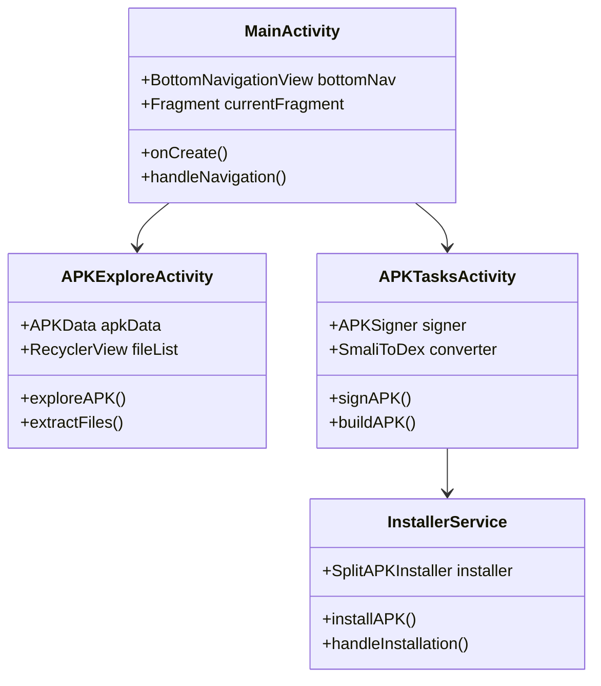

### Fragment Architecture

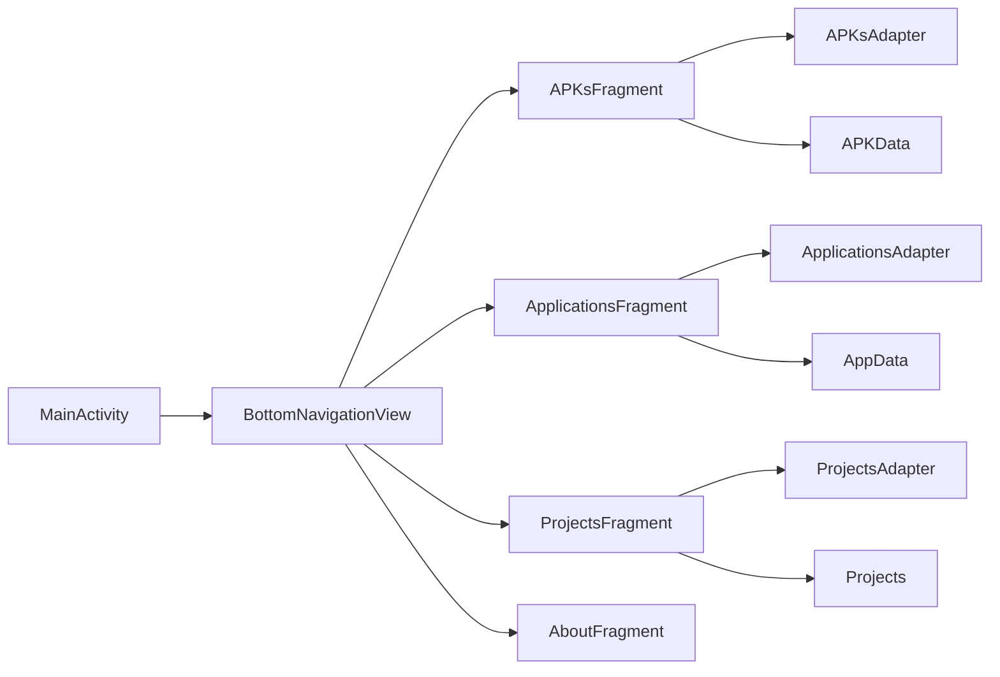

## Data Flow Architecture

### APK Processing Flow

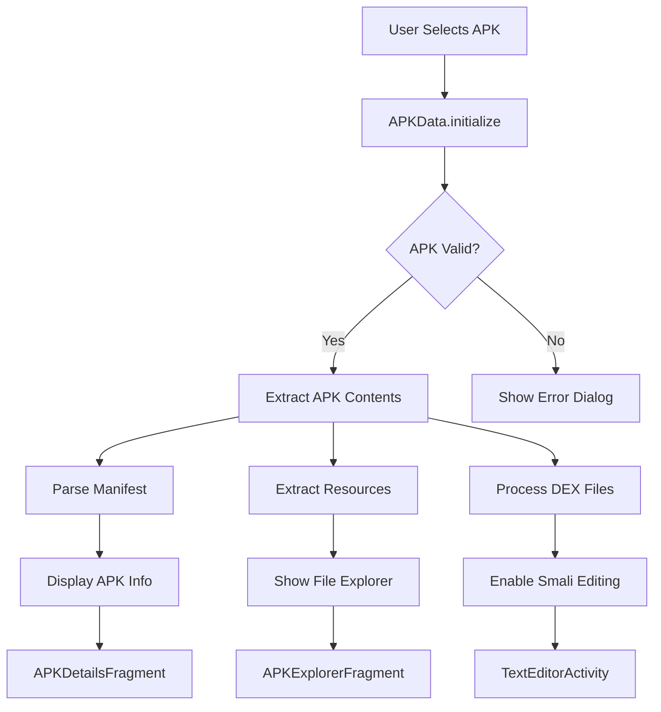

### File Operations Flow

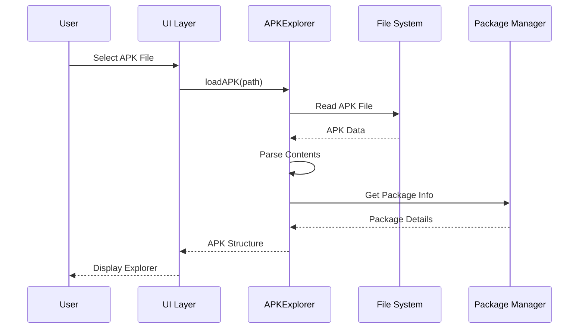

## Utility Layer Architecture

### Core Utilities

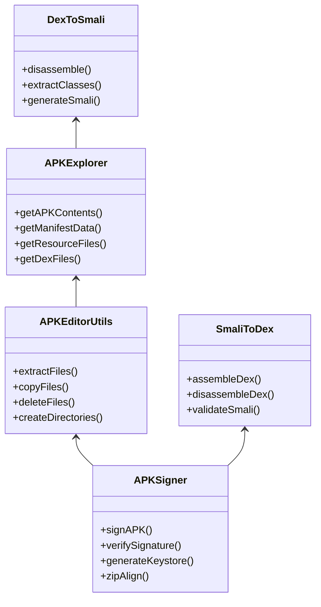

### Task Management

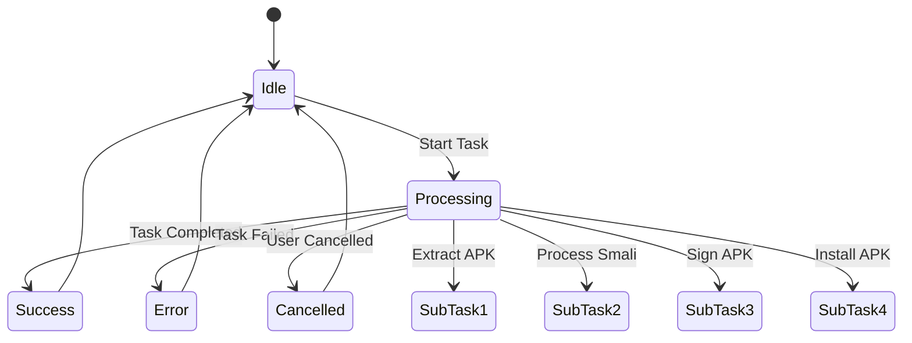

## Activity Navigation Flow

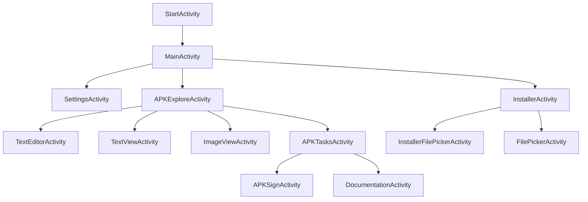

## Service Architecture

### Background Services

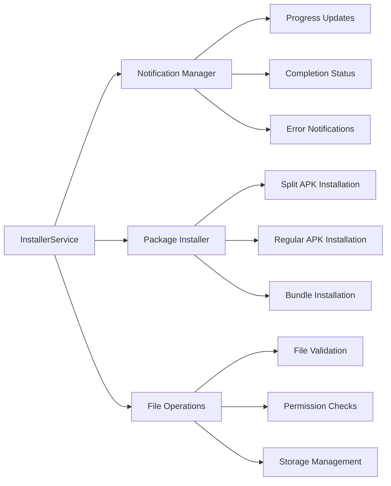

## Data Layer Architecture

### Data Models

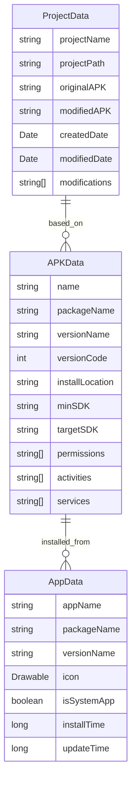

## Security Architecture

### APK Signing Process

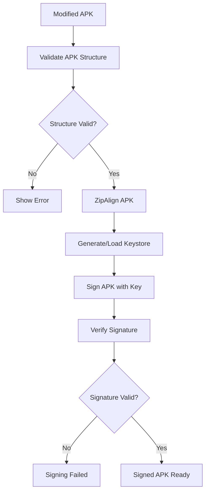

### Permission Management

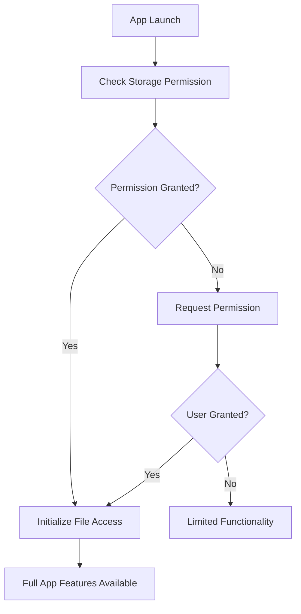

## Build and Deployment Architecture

### Build Process

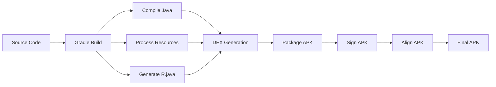

### Flavor Configuration

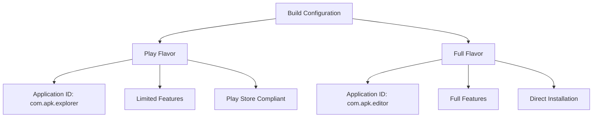

## Performance Considerations

### Memory Management

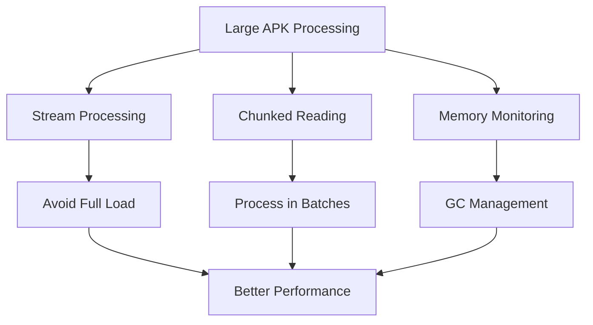

### Async Operations

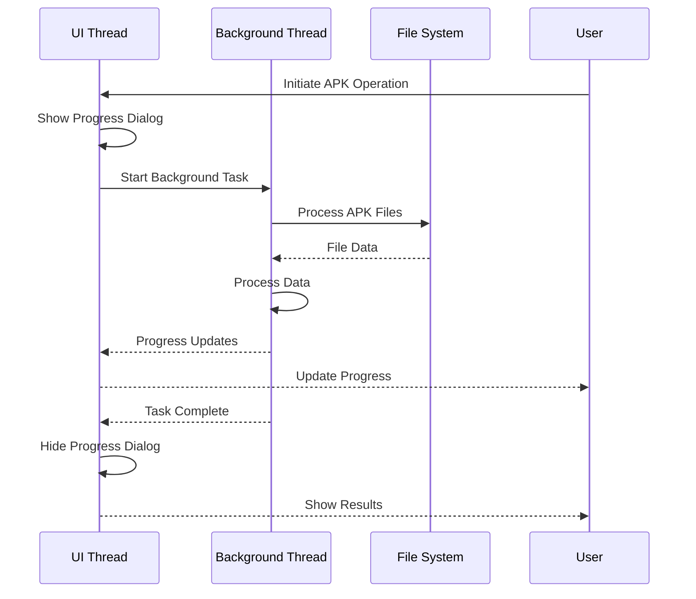

## Error Handling Architecture

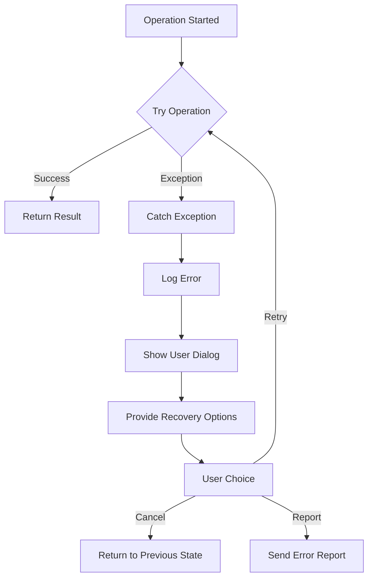

## Extension Points

The architecture provides several extension points for future enhancements:

1. **Plugin System**: Utility layer can be extended with new APK processing tools
2. **Custom Signers**: APKSigner can support additional signing methods
3. **New File Formats**: APKExplorer can be extended to support other Android formats
4. **Advanced Editing**: Text editor can be enhanced with syntax highlighting and validation
5. **Cloud Integration**: Data layer can be extended with cloud storage providers

## Dependencies and Third-Party Libraries

### Key Dependencies

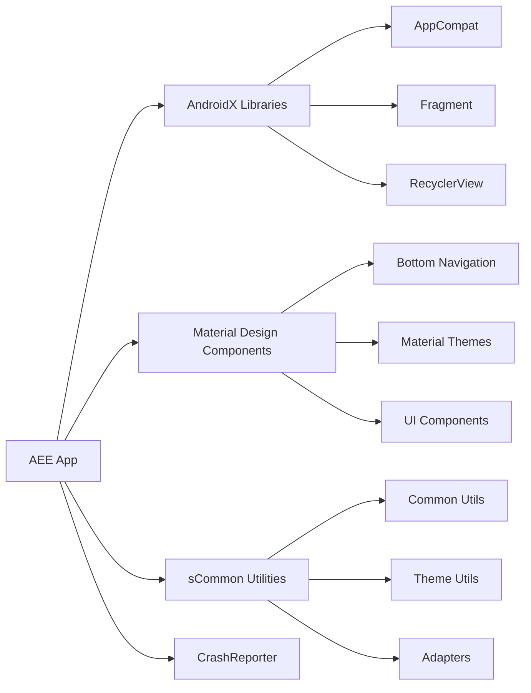

## Conclusion

The APK Explorer & Editor follows a well-structured Android architecture with clear separation of concerns. The modular design enables maintainability and extensibility while providing robust APK processing capabilities. The use of standard Android patterns ensures familiarity for developers and consistency with platform conventions.

## Future Architectural Improvements

1. **MVVM Pattern**: Consider migrating to Model-View-ViewModel architecture
2. **Dependency Injection**: Implement DI framework for better testability
3. **Repository Pattern**: Add repository layer for data access abstraction
4. **Coroutines**: Migrate from traditional async tasks to Kotlin Coroutines
5. **Modularization**: Split into feature modules for better build performance