# APK Explorer & Editor - Component Documentation

## Component Overview

This document provides detailed information about the individual components within the APK Explorer & Editor application architecture.

## Activity Components

### Core Activities

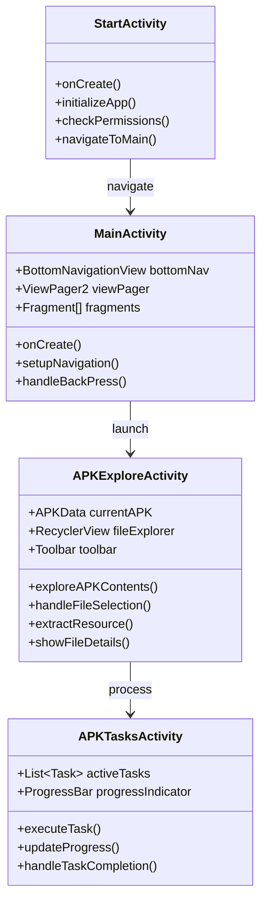

### Specialized Activities

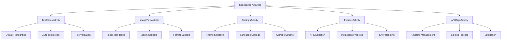

## Fragment Components

### Navigation Fragments

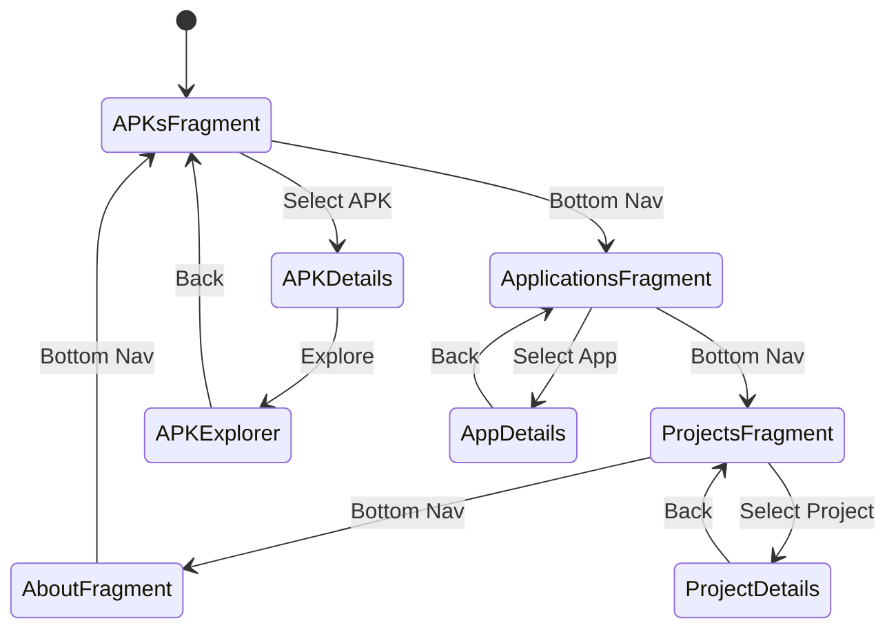

### Detail Fragments

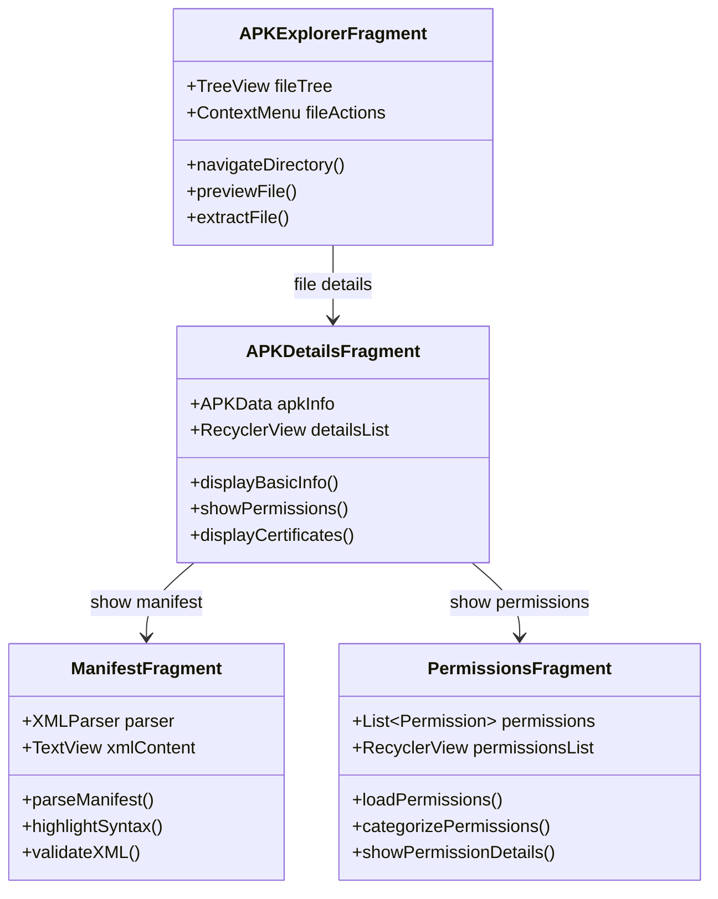

## Service Components

### Background Services

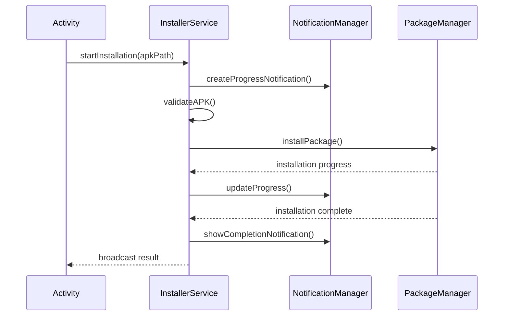

### Service Lifecycle

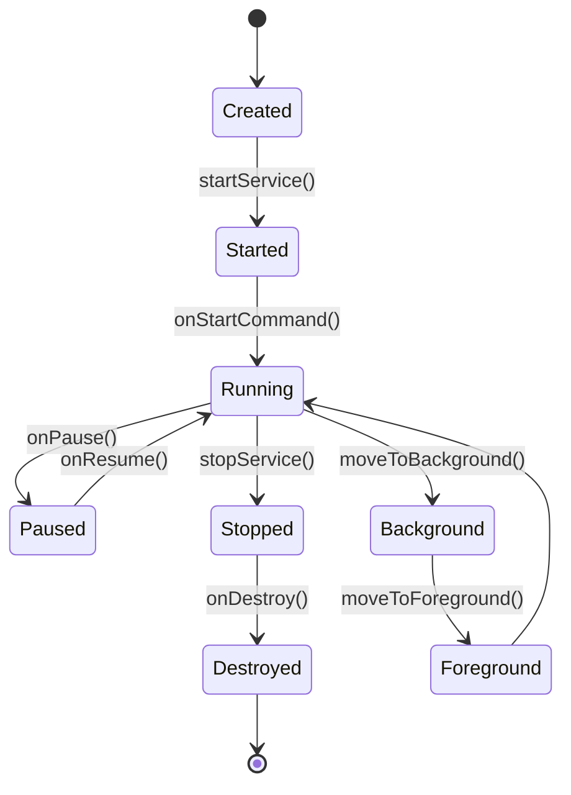

## Adapter Components

### RecyclerView Adapters

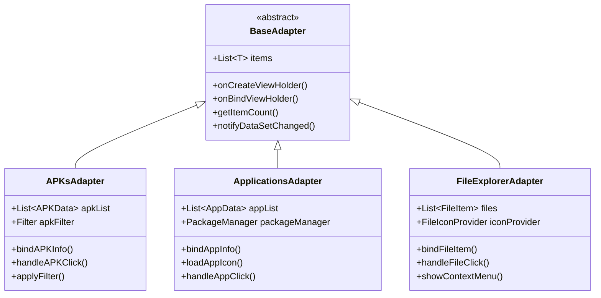

### Adapter Patterns

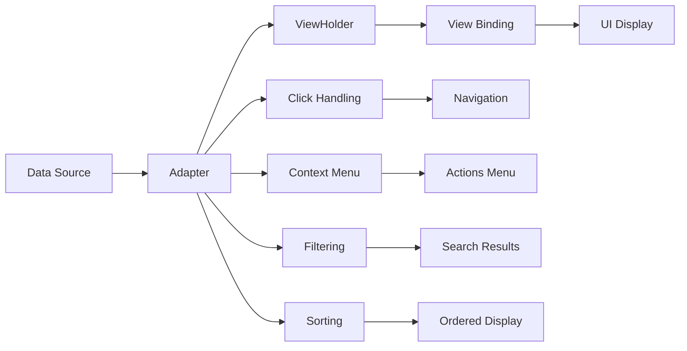

## Utility Components

### File Management Utilities

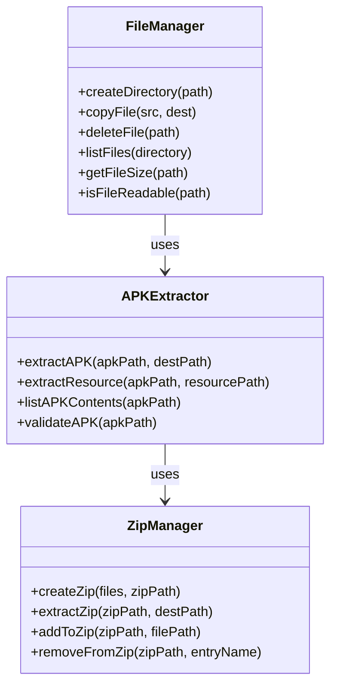

### Security Utilities

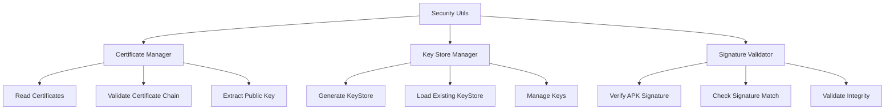

## Dialog Components

### Custom Dialogs

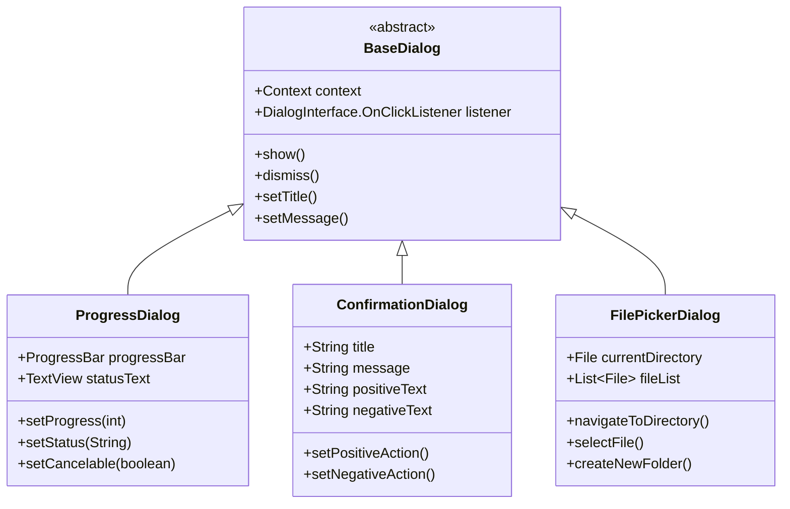

### Dialog Flow

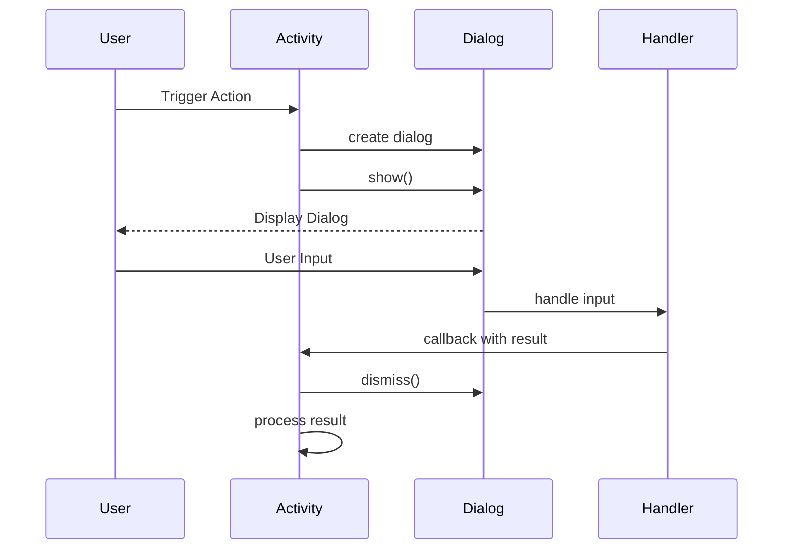

## Data Flow Between Components

### Inter-Component Communication

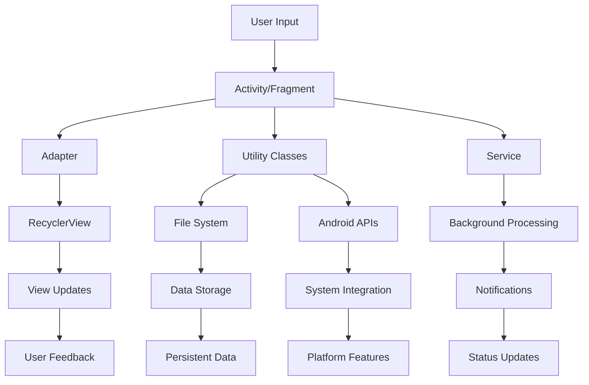

### Event Handling

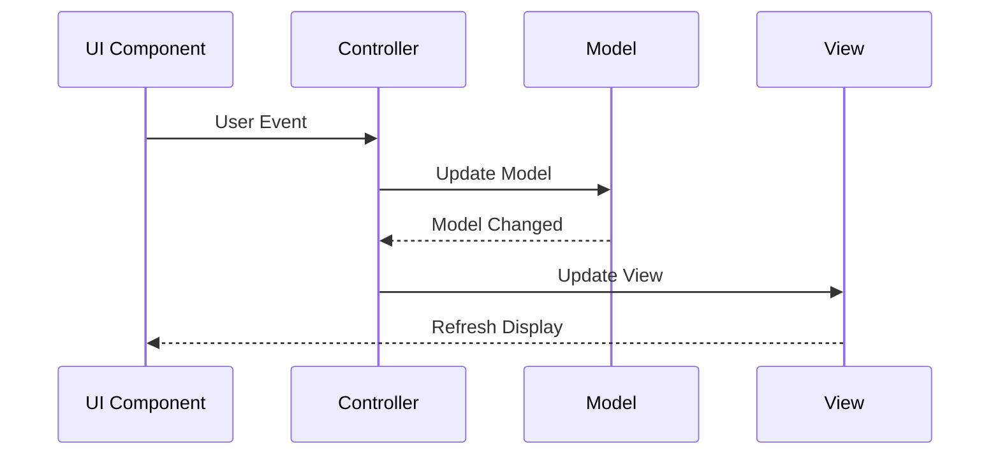

## Component Dependencies

### Dependency Graph

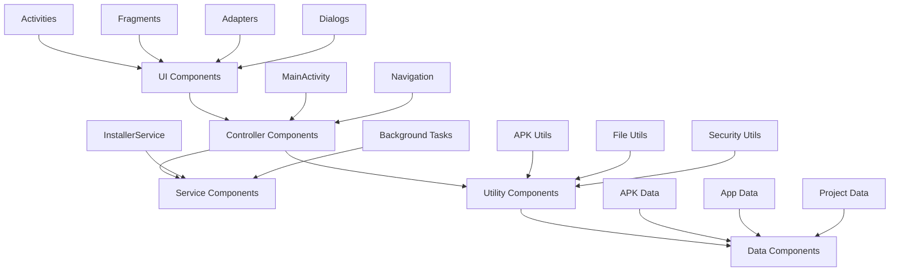

## Component Testing Strategy

### Unit Testing Structure

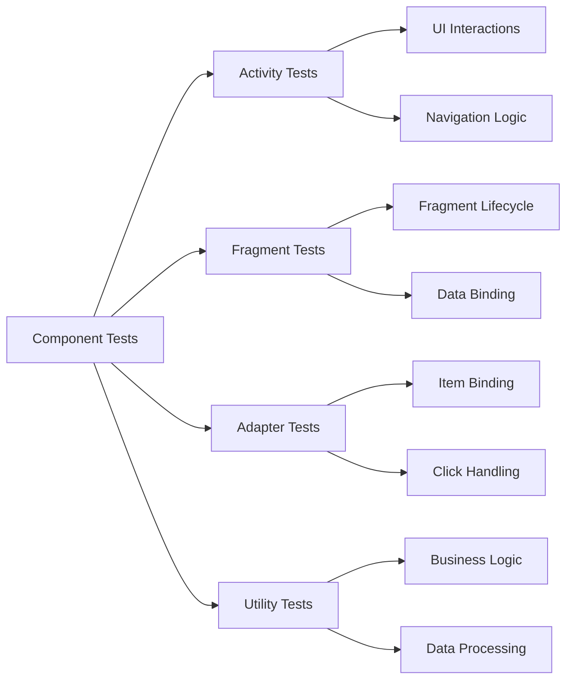

This component documentation provides detailed insights into how each part of the APK Explorer & Editor application is structured and how components interact with each other to deliver the application's functionality.