# APK Explorer & Editor - Data Flow Documentation

## Overview

This document details the data flow patterns, processing workflows, and information architecture within the APK Explorer & Editor application.

## APK Processing Pipeline

### Complete APK Processing Flow

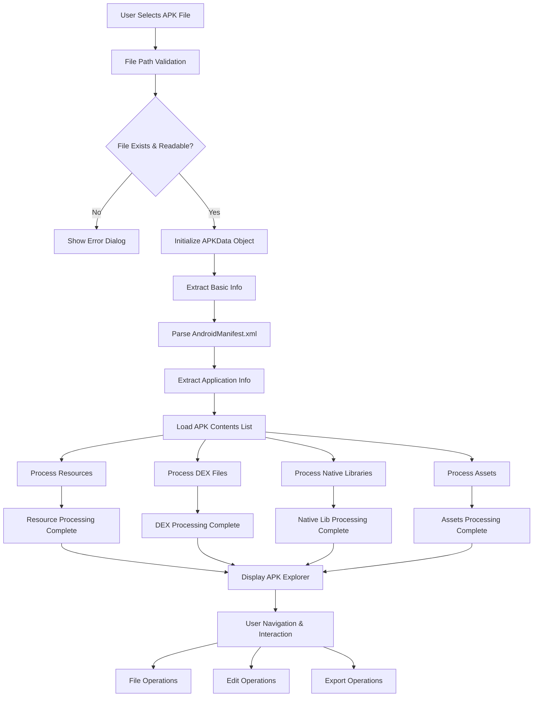

### APK Data Structure Flow

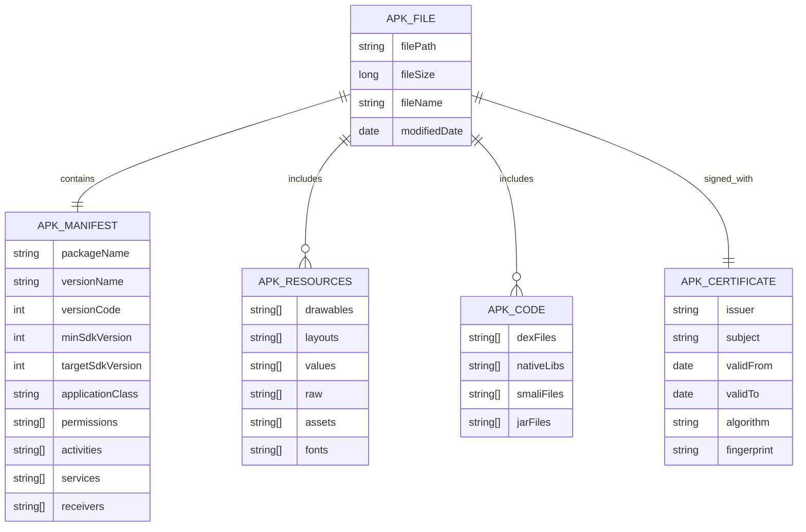

## User Interaction Data Flow

### Navigation Flow

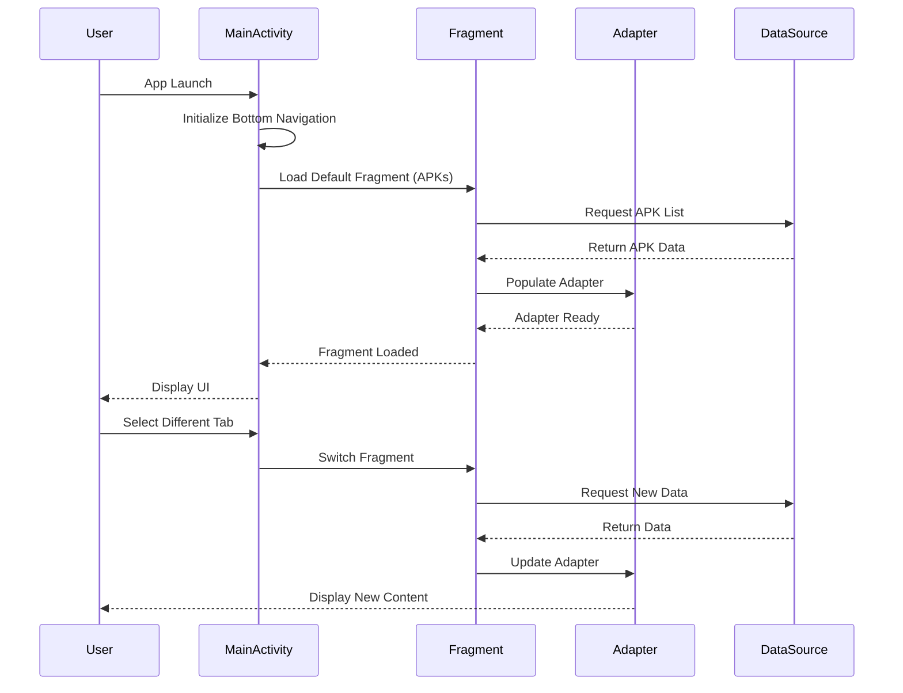

### APK Selection and Processing

```mermaid
graph TD
    A[User Clicks APK Item] --> B[APKsAdapter.onClick()]
    B --> C[Create Intent]
    C --> D[Start APKExploreActivity]
    D --> E[Load APK Data]
    
    E --> F[Display Loading Dialog]
    E --> G[Background Processing]
    
    G --> H[Read APK File]
    G --> I[Parse Manifest]
    G --> J[Extract File List]
    
    H --> K{Success?}
    I --> L{Success?}
    J --> M{Success?}
    
    K -->|No| N[Show Error]
    L -->|No| N
    M -->|No| N
    
    K -->|Yes| O[Continue Processing]
    L -->|Yes| O
    M -->|Yes| O
    
    O --> P[Hide Loading Dialog]
    P --> Q[Populate File Explorer]
    Q --> R[Enable User Interactions]
```

## File Operations Data Flow

### File Extraction Process

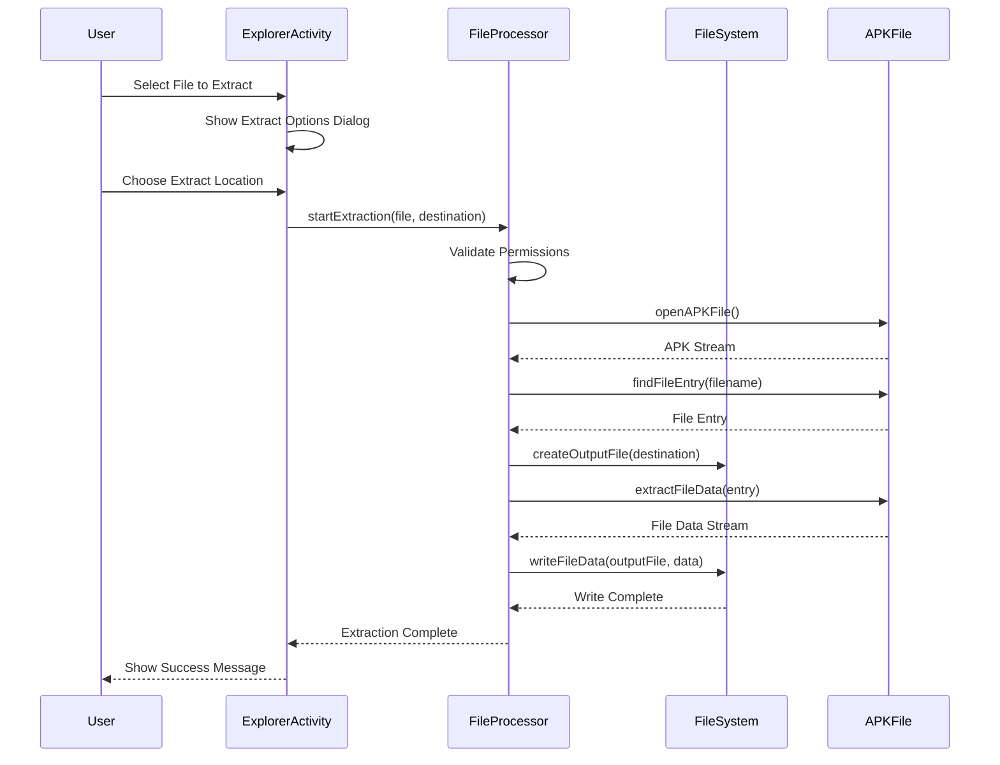

### File Modification Workflow

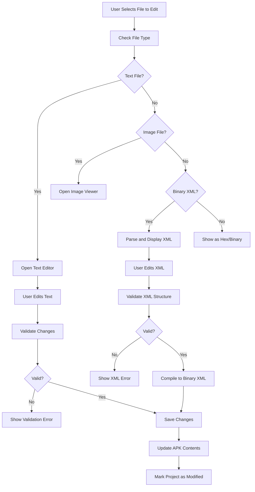

## Data Persistence Flow

### Project Management Data Flow

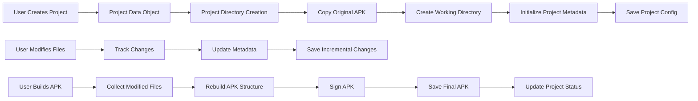

### Settings and Configuration Flow

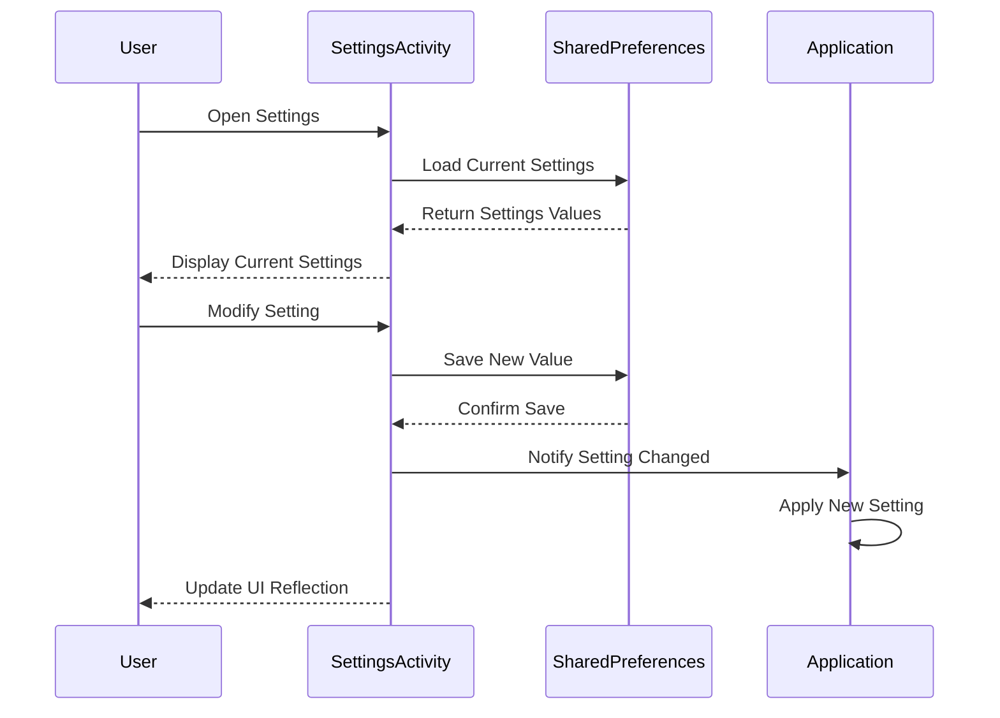

## APK Building and Signing Flow

### APK Assembly Process

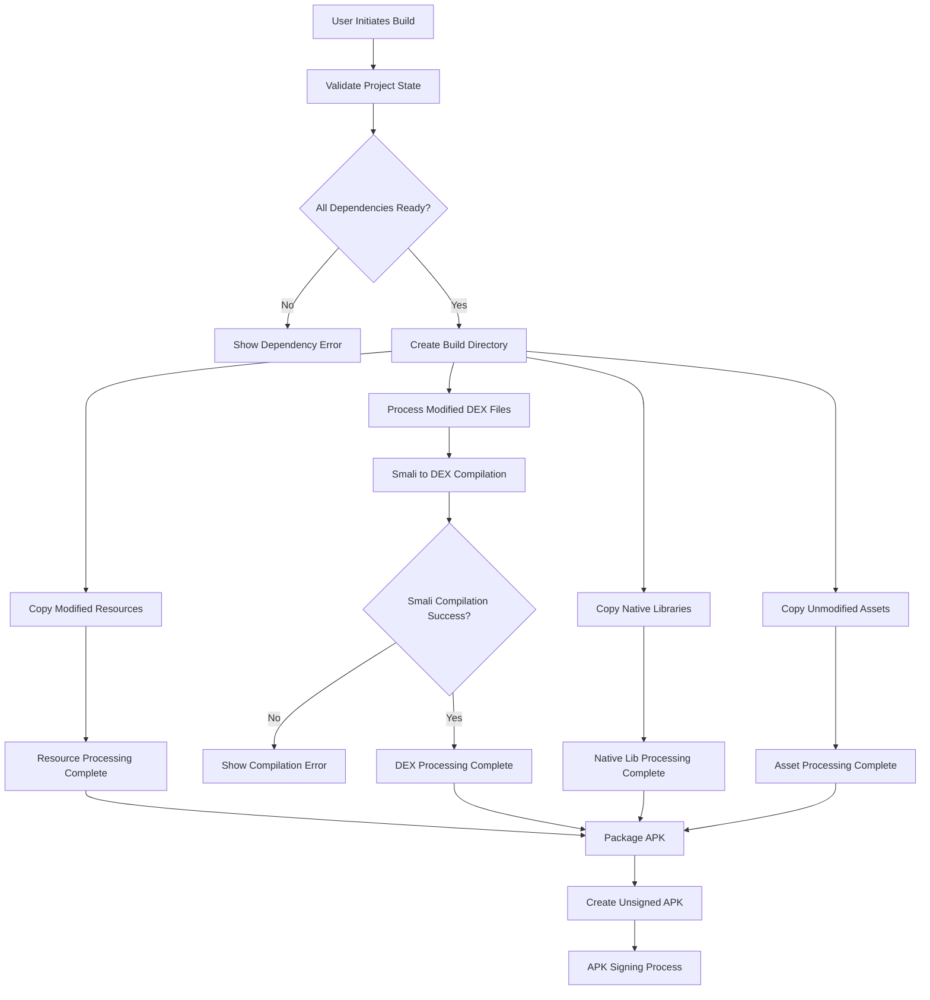

### Signing Workflow

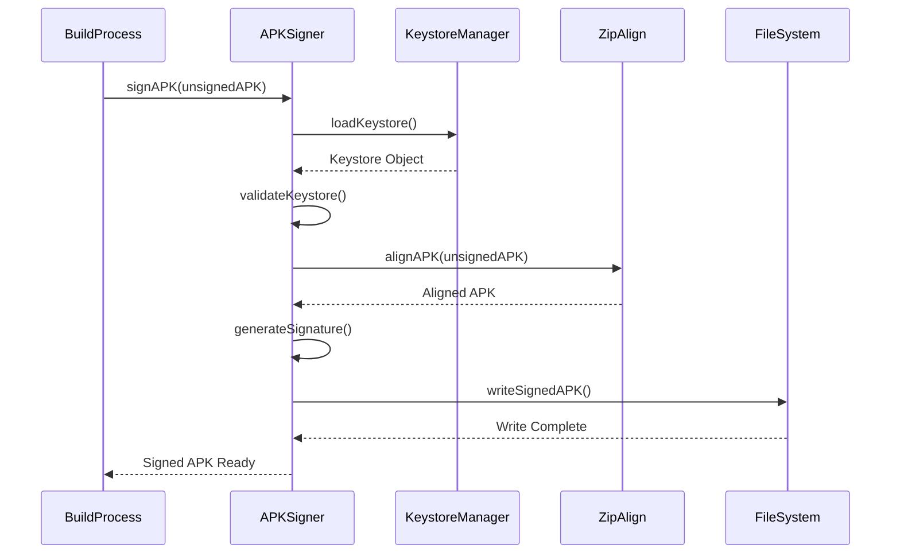

## Error Handling Data Flow

### Error Processing Pipeline

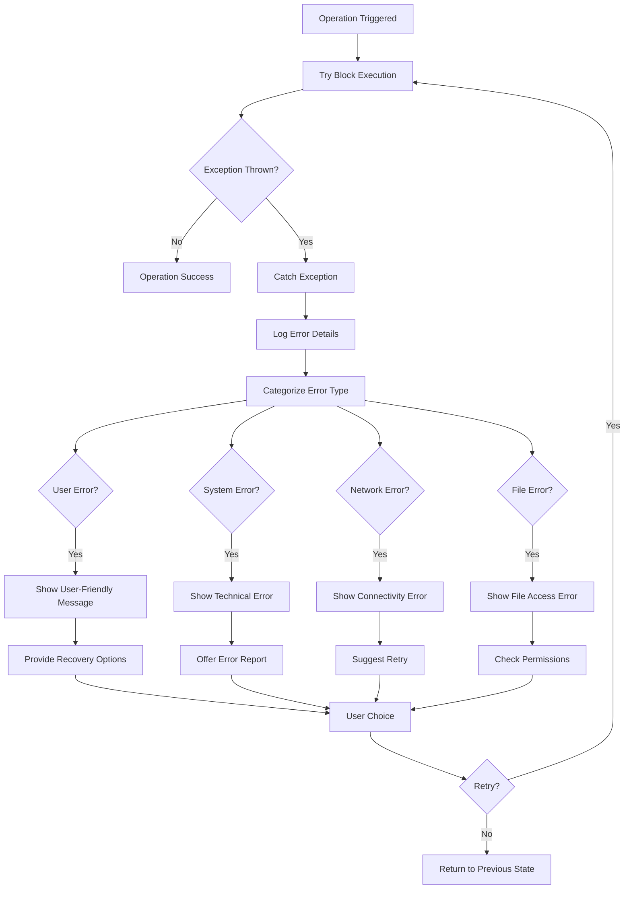

## Background Processing Data Flow

### Async Task Management

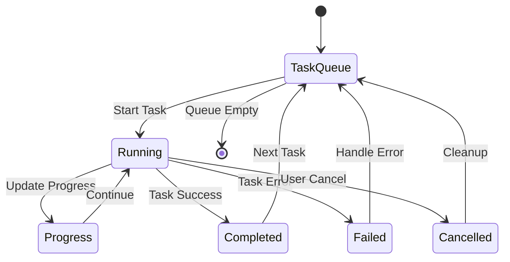

### Service Communication Flow

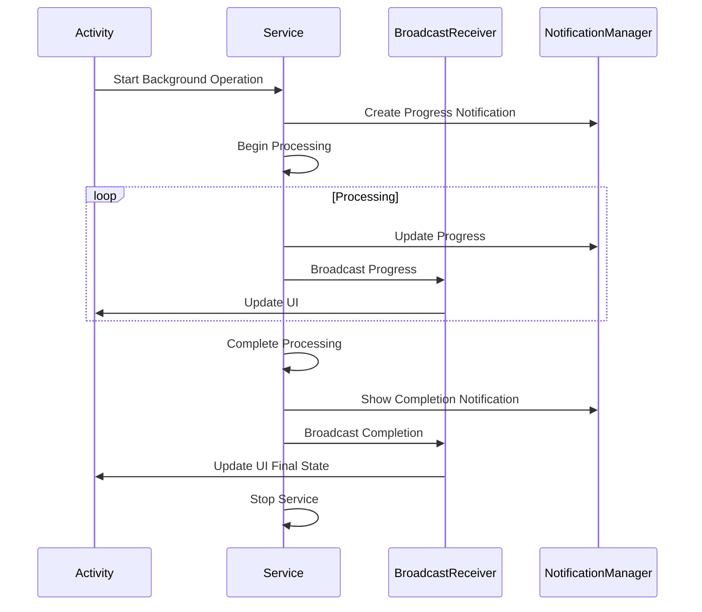

## Memory Management Data Flow

### Large File Processing

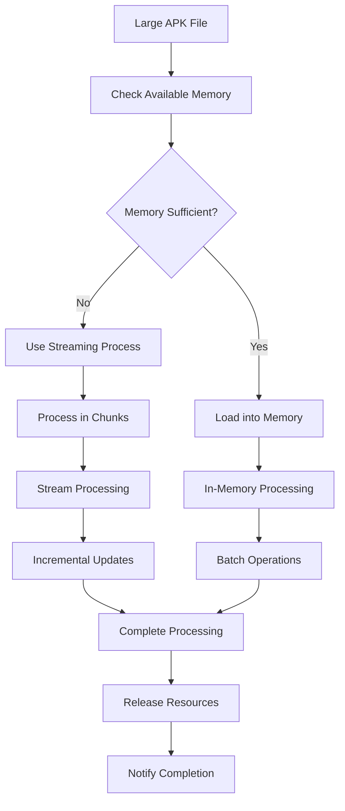

### Resource Cleanup Flow

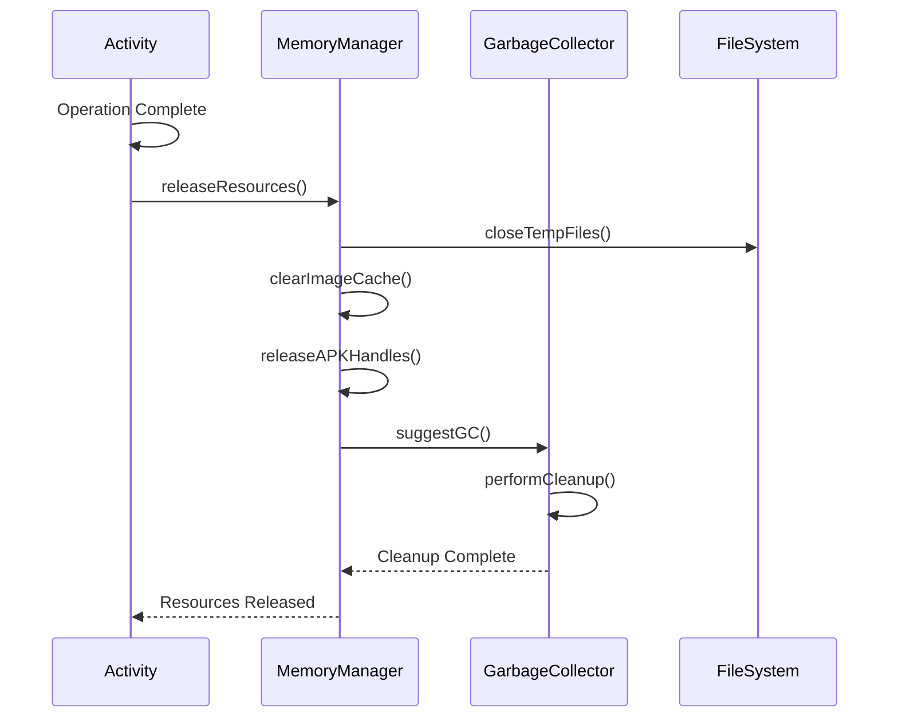

## Data Validation Flow

### Input Validation Pipeline

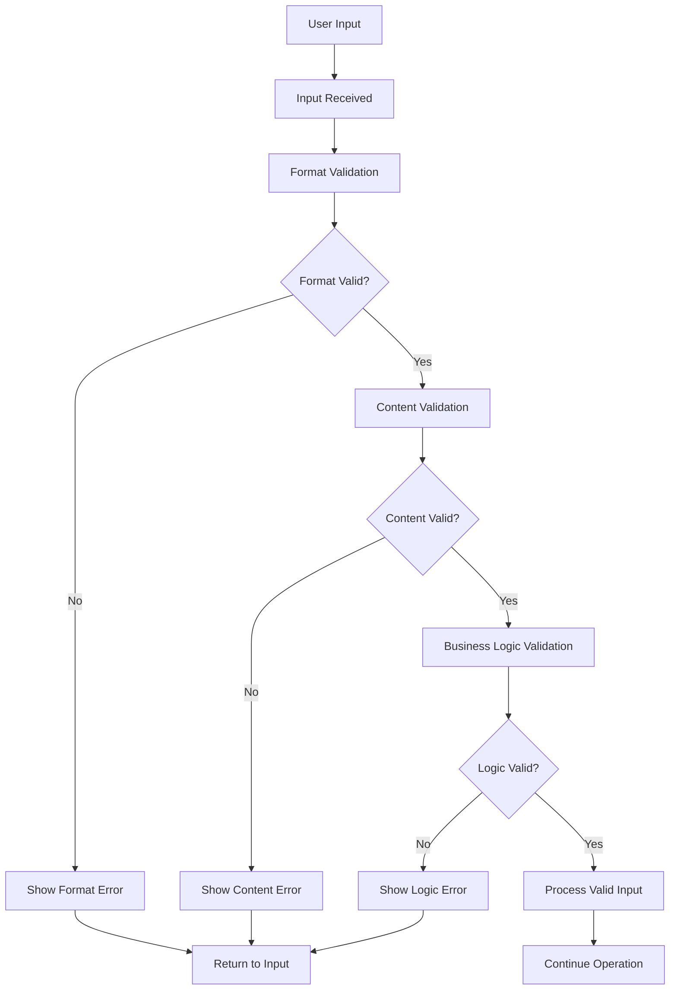

This data flow documentation provides comprehensive coverage of how information moves through the APK Explorer & Editor application, from user interactions to final output generation.