# APK Explorer & Editor - Deployment & Infrastructure Documentation

## Overview

This document outlines the deployment architecture, build processes, distribution mechanisms, and infrastructure considerations for the APK Explorer & Editor application.

## Build Architecture

### Gradle Build System

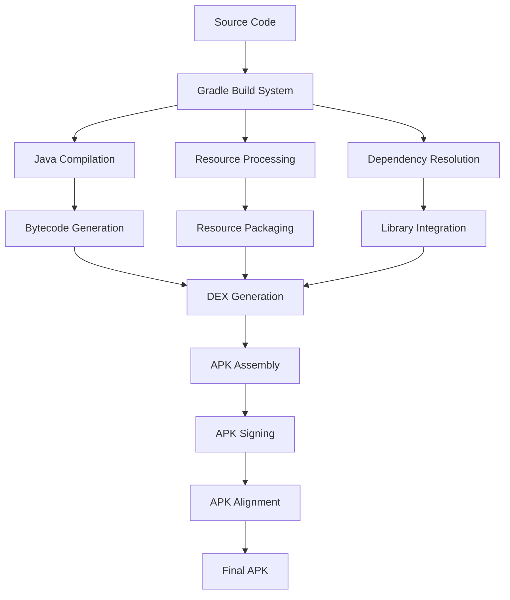

### Multi-Flavor Build Configuration

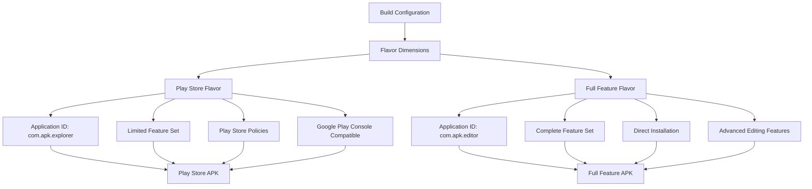

### Build Types and Configurations

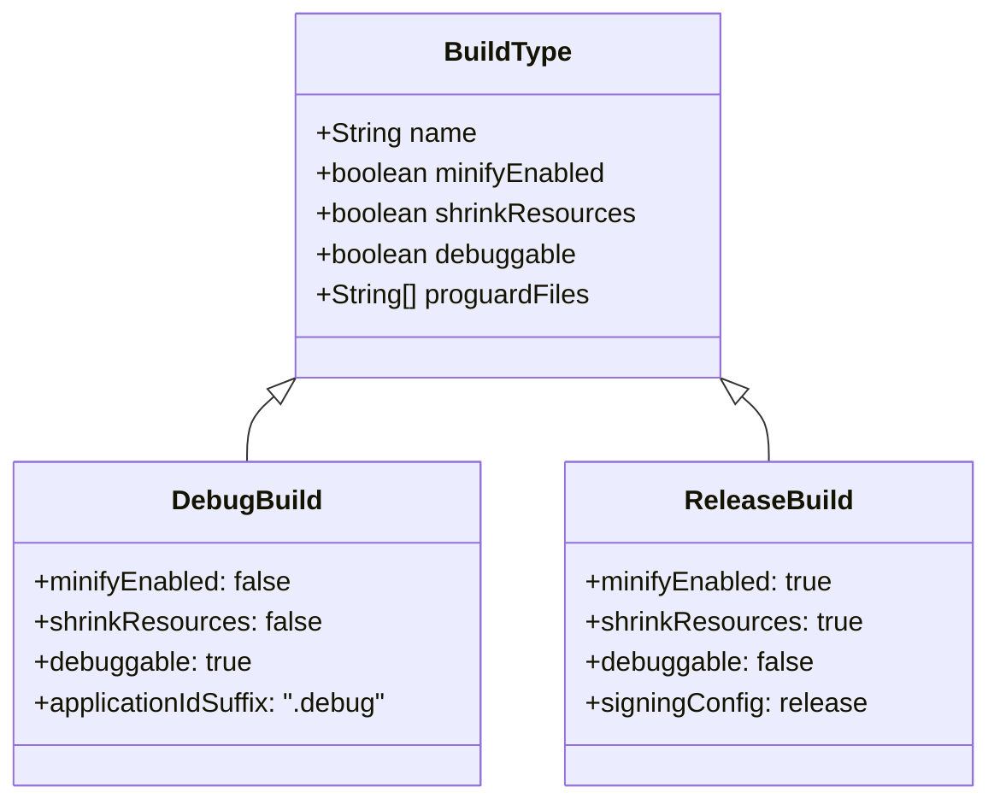

## Distribution Architecture

### Release Distribution Channels

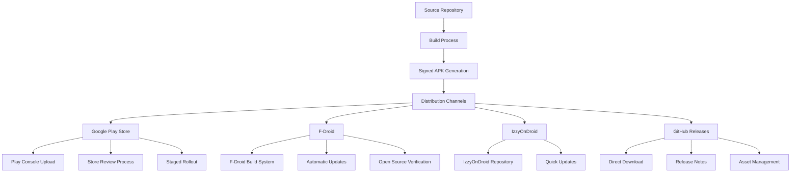

### Update Distribution Flow

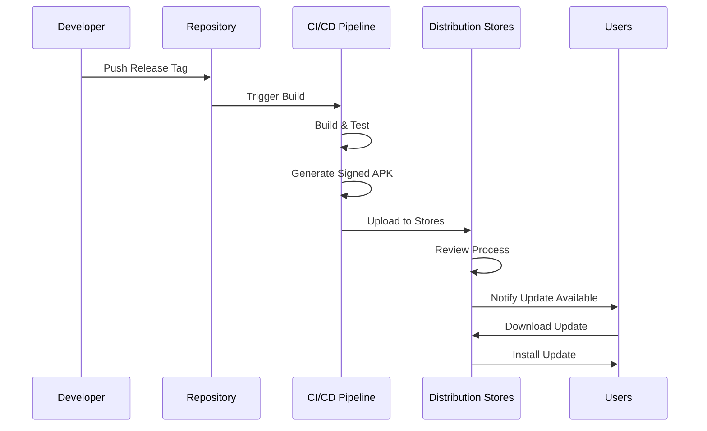

## CI/CD Pipeline Architecture

### Continuous Integration Flow

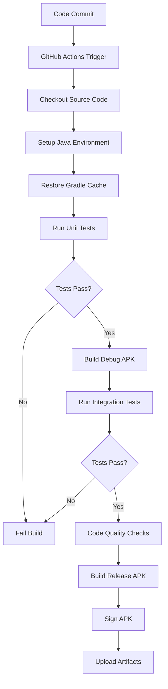

### GitHub Actions Workflow

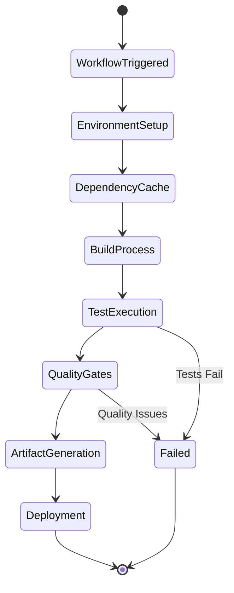

## Security Infrastructure

### Code Signing Architecture

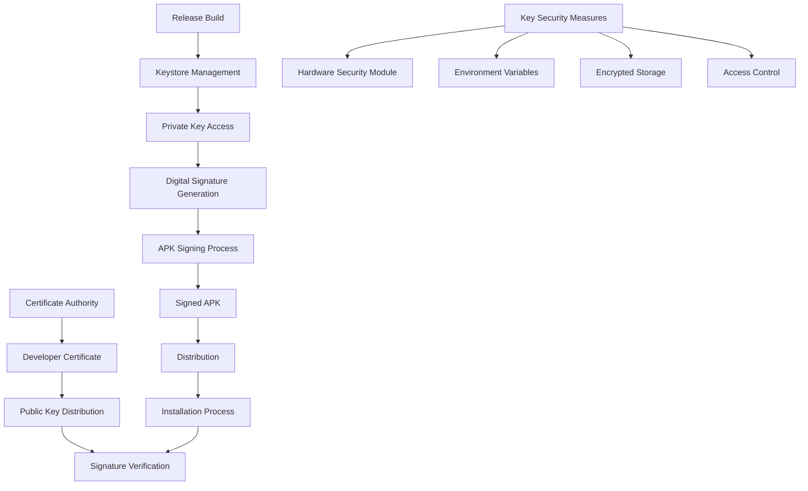

### Certificate Management

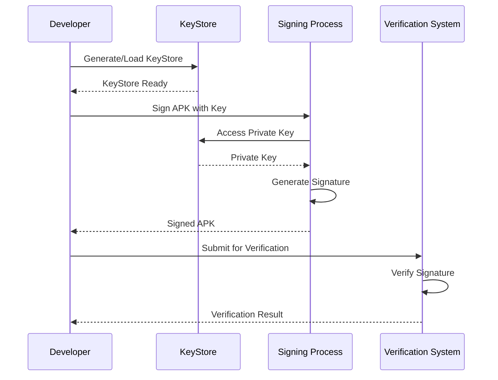

## Development Environment Architecture

### Local Development Setup

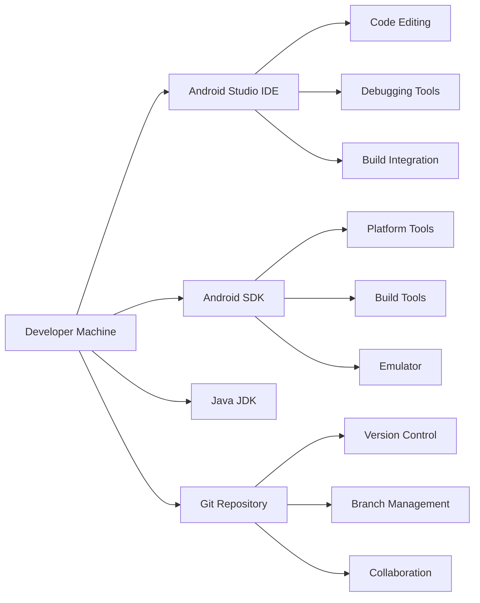

### Testing Infrastructure

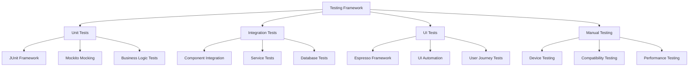

## Monitoring and Analytics

### Application Monitoring Architecture

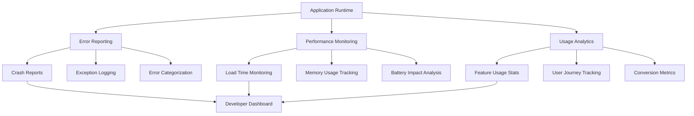

### Logging and Debugging Infrastructure

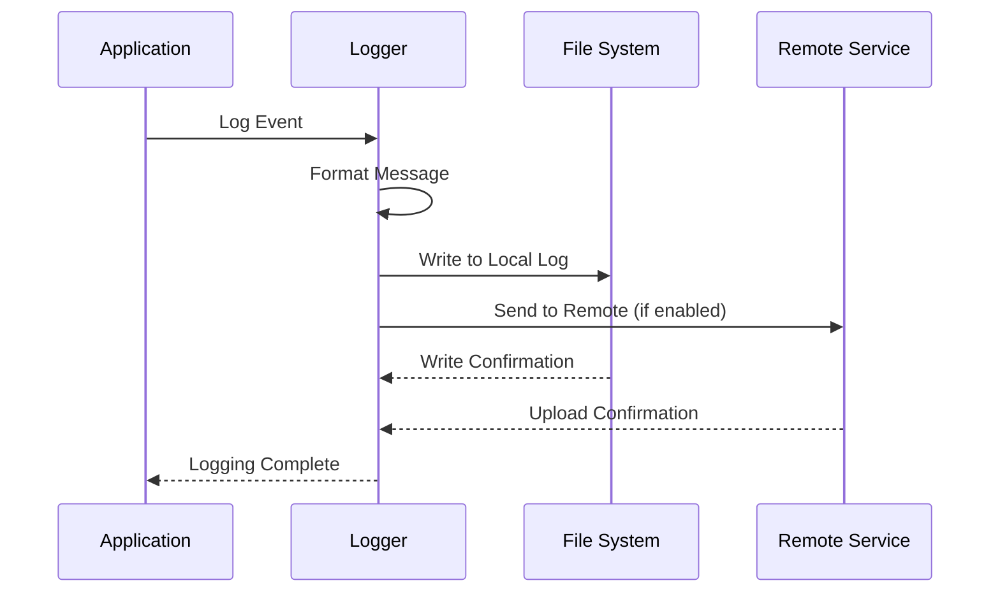

## Performance and Scalability

### Resource Management Architecture

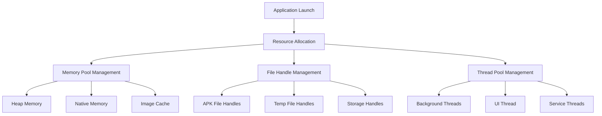

### Caching Strategy

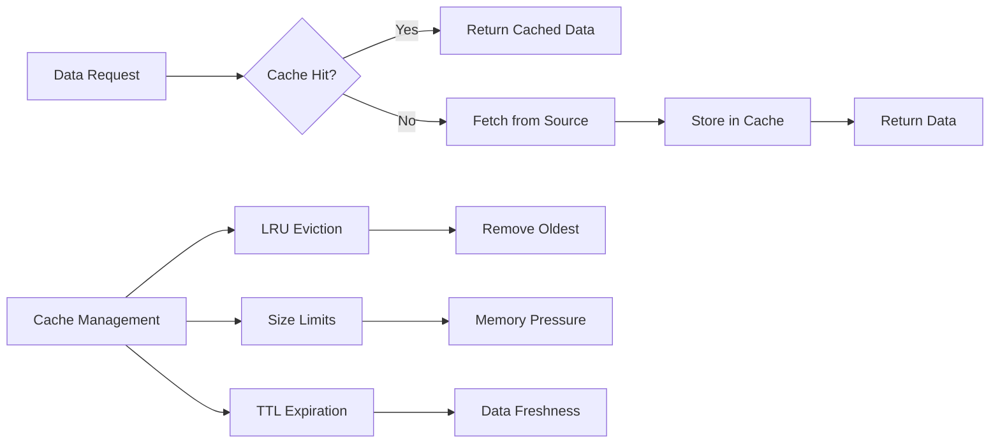

## Backup and Recovery

### Data Backup Strategy

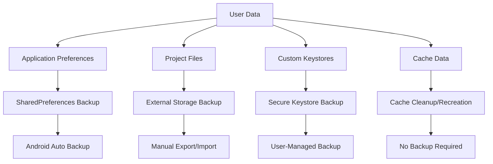

### Disaster Recovery Plan

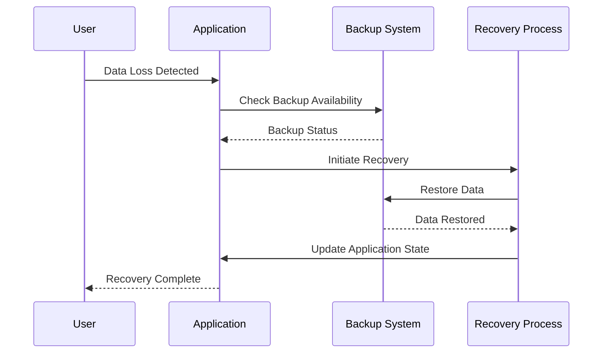

## Compliance and Security

### Security Compliance Architecture

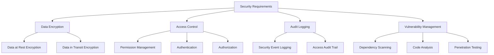

### Privacy Protection Measures

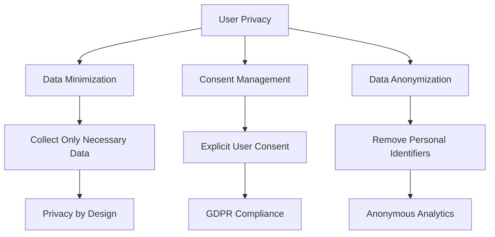

## Deployment Environments

### Environment Configuration

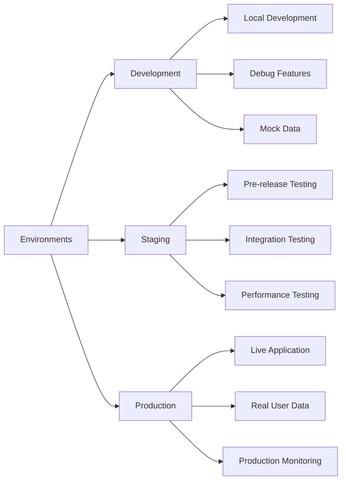

### Infrastructure as Code

```mermaid
graph TD
    A[Infrastructure Definition] --> B[Build Scripts]
    A --> C[Deployment Scripts]
    A --> D[Configuration Management]
    
    B --> E[Gradle Build Files]
    C --> F[CI/CD Pipelines]
    D --> G[Environment Configs]
    
    E --> H[Version Control]
    F --> H
    G --> H
    
    H --> I[Automated Deployment]
    I --> J[Consistent Environments]
```

This deployment and infrastructure documentation provides comprehensive coverage of the build, deployment, and operational aspects of the APK Explorer & Editor application.