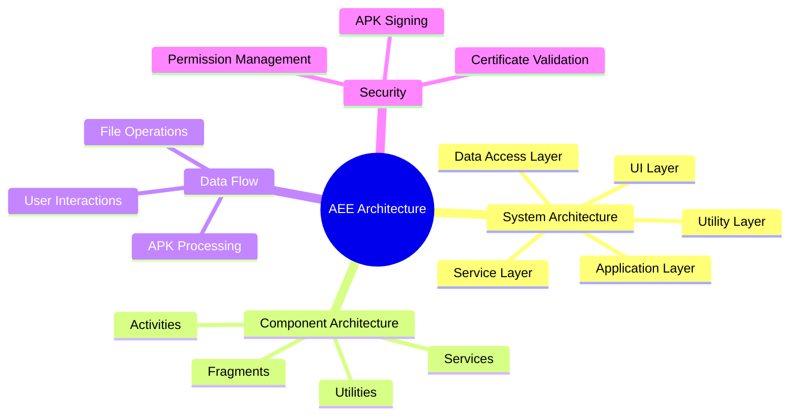
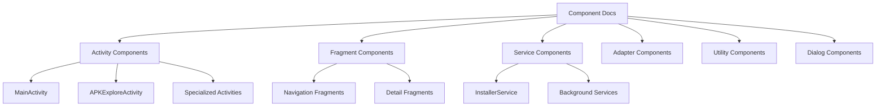
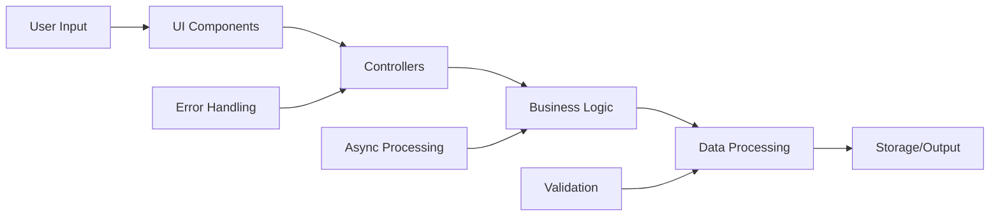
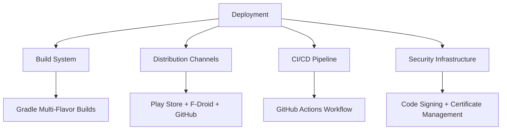
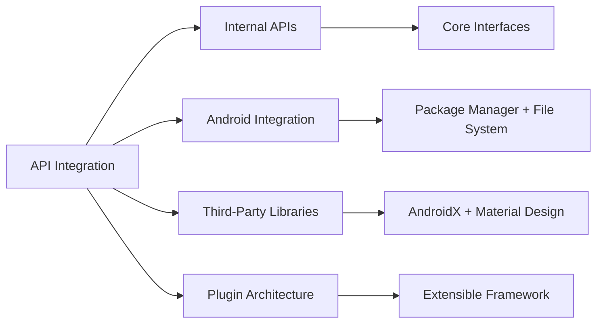
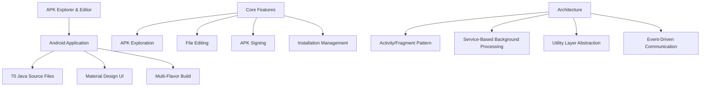

# APK Explorer & Editor - Technical Documentation Index

## 📚 Documentation Overview

This repository contains comprehensive technical architecture documentation for the APK Explorer & Editor (AEE) application. The documentation is organized into specialized documents that cover different aspects of the system architecture, design patterns, and implementation details.

## 📋 Documentation Structure

### 🏗️ [Main Architecture Documentation](./ARCHITECTURE.md)
**Primary system architecture and design patterns**

**Key Topics:**
- Overall system architecture with layered design
- Component relationships and dependencies  
- Core design patterns (MVC, Observer, Strategy)
- Security architecture and signing processes
- Performance considerations and memory management
- Future architectural improvements

---

### 🧩 [Component Documentation](./COMPONENTS.md)
**Detailed breakdown of individual components**

**Key Topics:**
- Individual component specifications
- Activity and fragment lifecycle management
- Service architecture and background processing
- Adapter patterns for UI components
- Dialog system and user interactions
- Component testing strategies

---

### 🌊 [Data Flow Documentation](./DATAFLOW.md)
**Information flow and processing workflows**

**Key Topics:**
- APK processing pipeline from selection to exploration
- File operation workflows and data transformations
- User interaction patterns and event handling
- Background processing and async operations
- Error handling and recovery mechanisms
- Memory management and resource cleanup

---

### 🚀 [Deployment Documentation](./DEPLOYMENT.md)
**Build processes, distribution, and infrastructure**

**Key Topics:**
- Gradle build system with multiple flavors
- Distribution channels (Play Store, F-Droid, GitHub)
- CI/CD pipeline with GitHub Actions
- Security and certificate management
- Development environment setup
- Performance monitoring and analytics

---

### 🔌 [API & Integration Documentation](./API_INTEGRATION.md)
**Internal APIs, system integration, and extensibility**

**Key Topics:**
- Core API interfaces and contracts
- Android system service integration
- Third-party library integration patterns
- Plugin architecture for extensibility
- Event system and inter-component communication
- Testing APIs and mock frameworks

---

## 🎯 How to Use This Documentation

### For New Developers
1. Start with [ARCHITECTURE.md](./ARCHITECTURE.md) to understand the overall system design
2. Review [COMPONENTS.md](./COMPONENTS.md) for detailed component information
3. Study [DATAFLOW.md](./DATAFLOW.md) to understand how data moves through the system
4. Check [DEPLOYMENT.md](./DEPLOYMENT.md) for build and development setup

### For System Architects
1. Focus on [ARCHITECTURE.md](./ARCHITECTURE.md) for high-level design patterns
2. Review [API_INTEGRATION.md](./API_INTEGRATION.md) for integration patterns
3. Study [DEPLOYMENT.md](./DEPLOYMENT.md) for infrastructure considerations

### For Contributors
1. Read [COMPONENTS.md](./COMPONENTS.md) to understand the component you're working on
2. Follow [DATAFLOW.md](./DATAFLOW.md) to understand data processing workflows  
3. Use [API_INTEGRATION.md](./API_INTEGRATION.md) for integration guidelines
4. Reference [DEPLOYMENT.md](./DEPLOYMENT.md) for build and testing procedures

## 🔍 Quick Reference

### System Overview

### Technology Stack
- **Platform**: Android (Min SDK 23, Target SDK 34)
- **Language**: Java
- **Build System**: Gradle with multi-flavor configuration
- **UI Framework**: AndroidX + Material Design Components  
- **Architecture**: MVC with Service Layer
- **Distribution**: Play Store, F-Droid, GitHub Releases

### Key Architectural Patterns
- **Layered Architecture**: UI → Application → Service → Utility → Data
- **Component-Based Design**: Activities, Fragments, Services, Utilities
- **Observer Pattern**: Event-driven communication between components
- **Strategy Pattern**: Pluggable APK processing and signing strategies
- **Factory Pattern**: Dialog and adapter creation
- **Template Method**: Base classes for common functionality

## 📊 Documentation Metrics

| Document | Pages | Diagrams | Key Topics |
|----------|-------|----------|------------|
| Architecture | ~25 | 15 | System design, patterns, security |
| Components | ~22 | 12 | Individual component details |
| Data Flow | ~24 | 13 | Processing workflows, error handling |
| Deployment | ~23 | 11 | Build system, CI/CD, monitoring |  
| API Integration | ~26 | 10 | APIs, integration, extensibility |
| **Total** | **~120** | **61** | **Complete system coverage** |

## 🎨 Diagram Legend

The documentation uses consistent Mermaid diagram styles:

- **🔄 Flowcharts**: Process flows and decision trees
- **📊 Class Diagrams**: Object relationships and interfaces  
- **📈 Sequence Diagrams**: Interaction patterns over time
- **🗺️ Graph Diagrams**: Component relationships and dependencies
- **📋 State Diagrams**: Component lifecycle and state transitions
- **🏗️ Entity Relationship**: Data model relationships

## 🔄 Documentation Maintenance

This documentation should be updated when:
- New major features are added to the application
- Architectural patterns or design decisions change
- New integration points or APIs are introduced
- Build or deployment processes are modified
- Security or performance considerations change

## 🚀 Getting Started Checklist

For developers new to the APK Explorer & Editor codebase:

- [ ] Read the main [ARCHITECTURE.md](./ARCHITECTURE.md) overview
- [ ] Set up development environment per [DEPLOYMENT.md](./DEPLOYMENT.md)  
- [ ] Study relevant components in [COMPONENTS.md](./COMPONENTS.md)
- [ ] Understand data flows in [DATAFLOW.md](./DATAFLOW.md)
- [ ] Review integration patterns in [API_INTEGRATION.md](./API_INTEGRATION.md)
- [ ] Build and run the application locally
- [ ] Execute unit tests and verify functionality
- [ ] Choose a component or feature to contribute to

## 📞 Documentation Feedback

If you find issues with this documentation or have suggestions for improvements:
1. Check existing issues in the repository
2. Create a new issue with the "documentation" label
3. Provide specific feedback about which document and section needs improvement
4. Include suggestions for additional diagrams or explanations that would be helpful

---

*This documentation was generated to provide comprehensive technical architecture coverage for the APK Explorer & Editor project. All diagrams are created using Mermaid syntax for consistency and maintainability.*